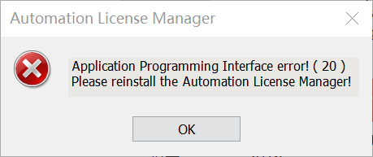

首先安装了西门子博途v15的软件。

安装过程中出现了错误

查看安装日志的报错信息可以找到错误根源。

日志显示：FAIL！ VC_2010_REDIST_X86
去安装了VC_2010_REDIST_X86解决了这个问题。

启动软件时也会遇见一些例如

的报错。

右键以管理员身份运行可以解决。（所有的软件都要以管理员身份运行）

### PLC

可编程逻辑控制器（programmable logic controller , PLC)->programmable controller是一台专为工业环境应用而设计制造的计算机。具有丰富的输入/输出接口及驱动能力。

#### 分类

1. 一体化紧凑型	PLC：电源、CPU中央处理系统、I/O接口都集成在一个机壳内。
2. 标准模块式结构化PLC：各模块相互独立，并安装在固定的机架（导轨）上，构成一个完整的PLC应用程序。

#### 功能

1. **控制功能：**

   逻辑控制

   定时控制

   计数控制

   顺序控制

2. **数据采集、存储与处理功能：**

   数学运算功能

   数据处理

   模拟数据处理

3. **输入/输出接口调理功能：**

   具有A/D、D/A转换功能，通过I/O模块完成对模拟量的控制和调节。

4. **通信、联网功能**

5. **人机界面功能**

6. **编程、调试等**

#### 特点
