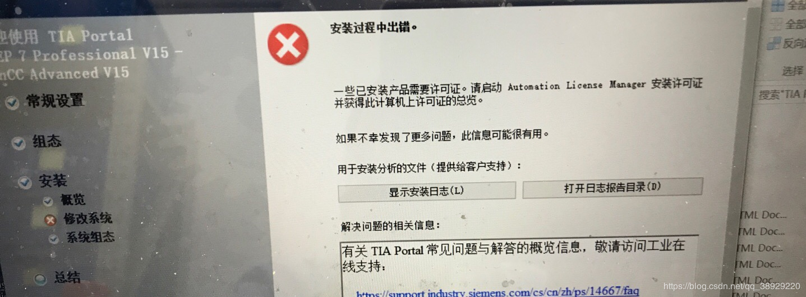

首先安装了西门子博途v15的软件。

安装过程中出现了错误

查看安装日志的报错信息可以找到错误根源。

日志显示：FAIL！ VC_2010_REDIST_X86
去安装了VC_2010_REDIST_X86解决了这个问题。

启动软件时也会遇见一些例如

的报错。

右键以管理员身份运行可以解决。（所有的软件都要以管理员身份运行）

### PLC

可编程逻辑控制器（programmable logic controller , PLC)->programmable controller是一台专为工业环境应用而设计制造的计算机。具有丰富的输入/输出接口及驱动能力。

#### 分类

1. 一体化紧凑型	PLC：电源、CPU中央处理系统、I/O接口都集成在一个机壳内。
2. 标准模块式结构化PLC：各模块相互独立，并安装在固定的机架（导轨）上，构成一个完整的PLC应用程序。

#### 功能

1. **控制功能：**

   逻辑控制

   定时控制

   计数控制

   顺序控制

2. **数据采集、存储与处理功能：**

   数学运算功能

   数据处理

   模拟数据处理

3. **输入/输出接口调理功能：**

   具有A/D、D/A转换功能，通过I/O模块完成对模拟量的控制和调节。

4. **通信、联网功能**

5. **人机界面功能**

6. **编程、调试等**

#### 特点

1. 高可靠性
2. 丰富的I/0接口模块
3. 采用模块化结构
4. 运行速度快
5. 功能完善
6. 编程简单，易于使用
7. 系统设计、安装、调试方便
8. 维修方便，维修工作量小
9. 总价格低

#### 工作原理

PLC的工作原理可简单的表述为在系统程序的管理下，通过运行应用程序，对控制要求进行处理判断，并通过执行用户程序来实现控制任务。

#### S7 1200

s7 1200基本包括CPU、信号板、通信板、电池板、数字量输入模块、数字量输出模块、模拟量输入模块、模拟量输出模块、通信模块、工艺模块。

它由以下基本元素组成：

- **OB（组织块，Organization block）**。组织块是CPU系统和用户程序之间的接口，新建一个程序时，系统会自动建立一个Main[OB1]程序，该程序会在PLC的每个扫描周期被调用。

​	OB块主要用于程序循环、启动、延时中断、循环中断、硬件中断、HSC（高速计数器）中断、诊断错误和时	 间错误八大事件。

​	OB块的优先级越高，中断级别越高，同样的优先级，编号越小越先执行。（可以手动选择OB块的语言和编号）

​	程序循环事件OB块：该块主要用于执行循环运行的程序，一般一个程序中创建一个默认的Main[OB1]即可，可以通过调用FC和FB来实现其他功能。系统CPU每个扫描周期都会执行该类型OB块。

​	启动事件OB块：该块主要用于初始化变量，当PLC断电重启或者CPU从STOP切换为RUN时候执行，往后不再运行（只运行一次）。

​	循环中断事件OB块：常常用于需要定时执行的任务。

​	诊断错误事件OB块：当PLC发生故障时，会触发该事件；解除故障时，也会触发该事件，在该模块里可以读到故障信息。

- **DB（数据块，Data block）**。主要用于储存用户数据。
- **FC（函数，Function）**。常常在FC中写一些需要重复执行的代码，可以在程序不同地方调用，可以被OB调用，也可以被FC调用。使用FC可以简化需要重复执行的任务，提高代码的运行效率。
- **FB**。FC+DB组合，是含有DB块的FC函数，与FC的区别是当函数调用结束后，通过Static变量仍然可以保留数值，常用于调用间的数据共享。

